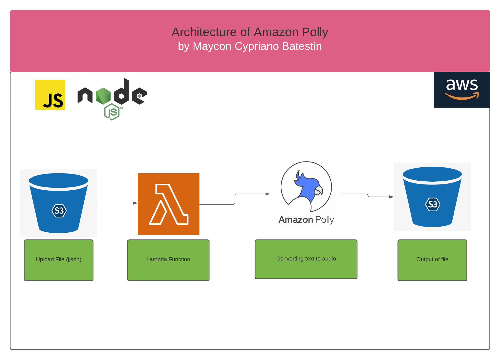

<h1 align="center">

<h3> 
AMAZON POLLY  
 </h3>
<h3> 
 ================= 
 </h3>

>> Arquitetura da solução:

>> <h3> Description </h3>
-------------------------

 
Amazon Polly is a cloud service from Amazon Web Services, a subsidiary of Amazon.com, that converts text into spoken audio. It allows developers to build speech-enabled applications and products. 
In summary.
In this project we developed a REST API with the API GATEWAY that sends a request to a lambda function containing the text to be converted by Amazon Polly (in this case, a poem by Drummond) and after this conversion, an audio file in mp3 is saved in a bucket S3. 

